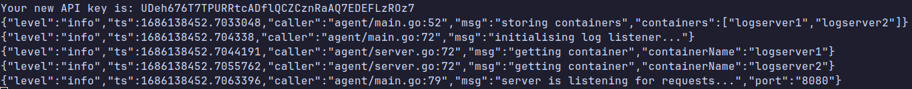
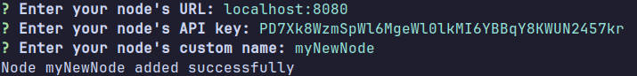
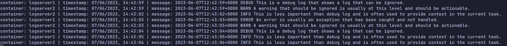
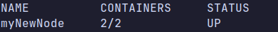
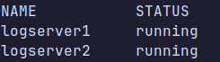

# Overview
`centralog` is a CLI tool used for reading logs from docker containers. It can read logs in real time from multiple containers, 
as well as filter logs by certain criteria.

It's ideal for use cases where you want to read logs from multiple containers at once. Centralog will aggregate the logs 
and display them, making it seem like you are reading logs from only one container.

# Setup
Centralog consist of two parts, the `agent`, which runs on your server, and the CLI tool, which runs on your personal machine.

## Agent setup
Running the `agent` is as simple as running a single docker command:
```shell
sudo docker run -v ~/centralog/data:/data -p 8080:8080 \
-v /var/run/docker.sock:/var/run/docker.sock \ 
-e CONTAINERS=logserver1,logserver2 \
--name centralog xiovv/centralog:latest
```

The `CONTAINERS` environment variable tells the `agent` which containers it should monitor. If you want it to monitor all of your containers, then set the `MONITOR_ALL_CONTAINERS` to true.

Output:


Take note of that API key written at the very top of the output, we will need it for setting up the CLI. And that's it, the agent is ready.

## CLI Setup
### Build and install from source
Clone the repository:
```shell
git clone https://github.com/XiovV/centralog.git
```
Build the CLI binary:
```shell
cd centralog/cmd/cli
go build
```
Now you should see a new binary called `cli`.

### Adding a new node:
To add a new node, run the `./cli add node` command, and an input prompt will show up:



If any of the inputs is invalid (such as if the provided URL is unreachable, or if the API key is incorrect) you will receive an error message, so you cannot add a node with incorrect data by accident.

### Monitoring logs
In order to monitor logs in real time, run this command:
```shell
./cli logs myNewNode
```

You should see the logs being displayed as they are coming in real time. As you can see, both `logserver1` and `logserver2`'s logs are being displayed.

### Listing nodes
If you'd like to list your nodes and check their statuses, run this command:
```shell
./cli list nodes
```


### Listing containers
If you'd like to list the containers of a specific node, run this command:
```shell
./cli list containers myNewNode
```


